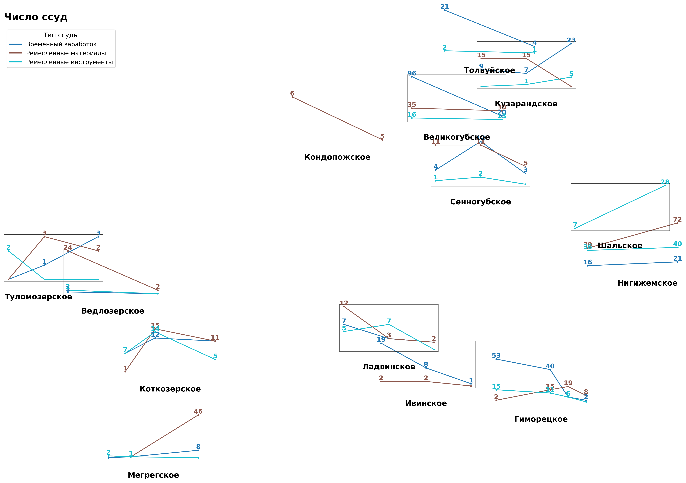

# LLLE-R1900s
Loans, Livelihoods, and Local economies - Russia, 1900s

Кредиты, занятость и сельская экономика - Россия, начало XX века

# 🚀 Setup & Run in Cursor AI 
The program can be run as follows:
    
    python3 -m venv .venv
    source .venv/bin/activate
    pip install -U pip
    pip install -r requirements.txt
    python src/python.py

# 📊 Visualizations & Notebooks
[src/visualization/grouped_bar_chart.ipynb](src/visualization/grouped_bar_chart.ipynb) compares the scale and frequency of loans for artisanal and migratory economic activities in early 20th-century rural Russia (сравнивает масштаб и частоту ссуд на ремесленные и сезонные заработки в сельской России начала XX века).  

The same notebook also generates a schematic map with sparklines showing annual dynamics of loan amounts and counts for each credit society with two or more years of data (схематичная карта с мини-графиками (sparklines), показывающими динамику суммы и количества ссуд по годам для каждого товарищества с двумя и более годами данных).  

